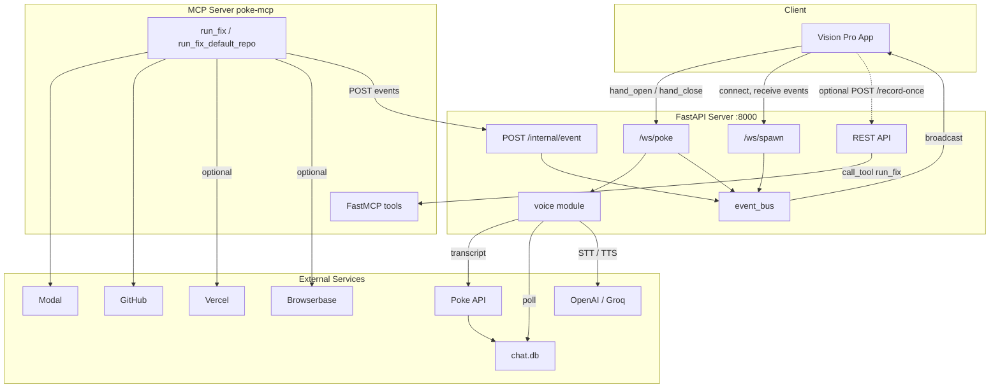
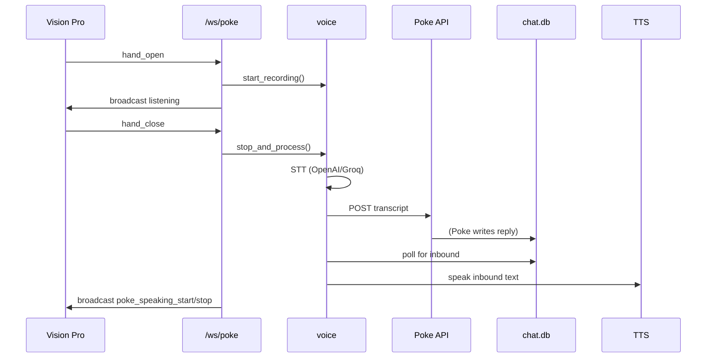
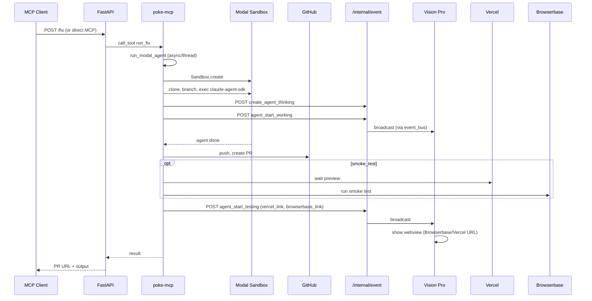

# TreeHacks System Design

High-level architecture of the voice + fix-agent stack.

## Component overview

## Data flows

### 1. Voice (Vision Pro → server → Poke → talkback)

### 2. Fix agent (client → server → MCP → Modal → GitHub → Vision Pro)

### 3. Event bus

- **Registered connections:** WebSockets that called `event_bus.register(ws)` — currently `/ws/poke` and `/ws/spawn`.
- **Producers:** `POST /internal/event` (from poke-mcp), and voice (e.g. `listening`, `poke_speaking_start`).
- **Consumers:** Vision Pro (and any other WS client). All registered clients receive every broadcast.

## Main directories

| Path | Role |
|------|------|
| `server/` | FastAPI app: /fix, /ws/poke, /ws/spawn, /internal/event, voice endpoints. event_bus, voice logic. |
| `poke-mcp/` | MCP server (FastMCP): run_fix, run_fix_default_repo, run_analysis, list_tools. Calls Modal, GitHub, posts to EVENT_WEBHOOK_URL. |
| `treehacks26/` | Vision Pro (Swift): connects to server baseURL, /ws/poke + /ws/spawn, renders agents + webviews. |
| `sound-effects/` | Audio files for recording start/stop and no-recording. |

## Key env (concise)

- **Server:** `MCP_HTTP_URL` (poke-mcp URL), voice: `OPENAI_API_KEY`, `POKE_API_KEY`, `POKE_HANDLE_ID`, `CHAT_DB_PATH`, `RECORD_MAX_SECONDS`, etc.
- **poke-mcp:** `ANTHROPIC_API_KEY`, `MODAL_*`, `GITHUB_TOKEN`, `EVENT_WEBHOOK_URL`, `RUN_FIX_IN_BACKGROUND`, `RUN_FIX_SMOKE_TEST`, `RUN_FIX_MAX_CONCURRENT`.
- **Vision Pro:** `APIConfig.baseURL` (e.g. tunnel to server).

## Run order (typical)

1. Start FastAPI: `./start.sh` (port 8000).
2. Start poke-mcp (e.g. `cd poke-mcp && ./start.sh`); set `EVENT_WEBHOOK_URL` to `http://localhost:8000/internal/event` if local.
3. Optional: Cloudflare (or other) tunnel to 8000; Vision Pro uses that as baseURL.
4. Vision Pro: connect to `baseURL/ws/poke` and `baseURL/ws/spawn` to use voice and agent UI.
